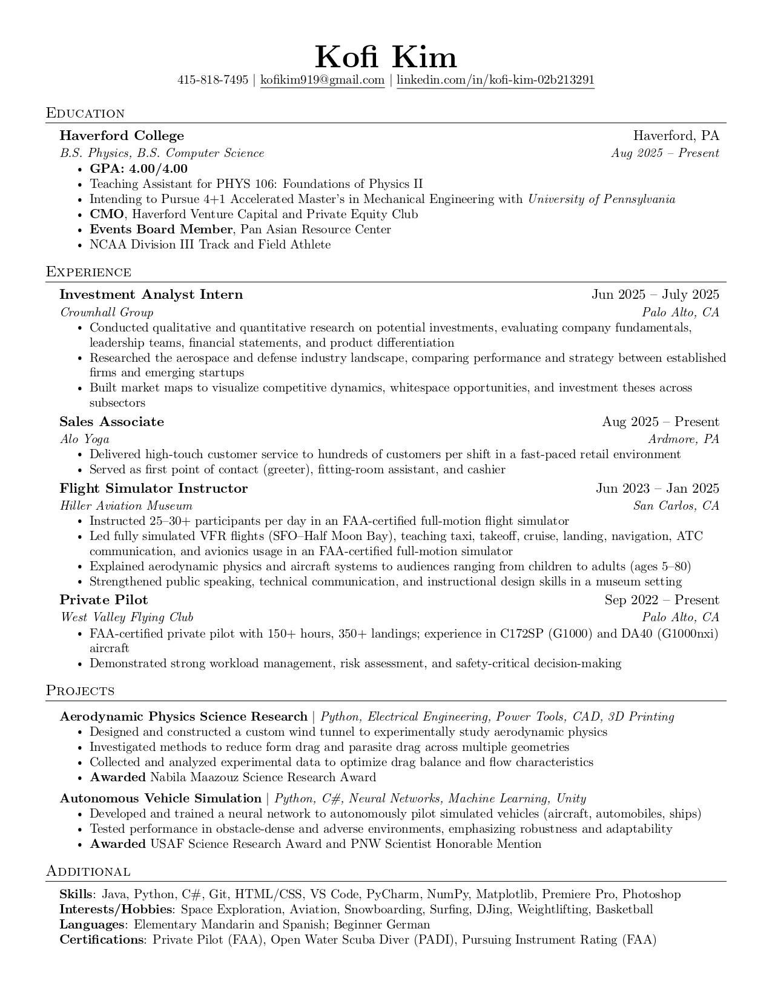

# 📄 Resume – Kofi Kim

This repository contains the latest version of my résumé, coded in LaTeX.

---

## 👨‍💻 Resume Code

👉 **[View File (LaTeX)](./kofi_kim_resume.tex)**

---

## 📎 Download

👉 **[Download Resume (PDF)](./Kofi_Resume_Feb_2026.pdf)**

---

## 👀 Preview

---

## 🧠 About Me

I’m a Physics & Computer Science undergraduate with interests in:
- Aerospace systems & simulation  
- Applied machine learning  
- Software engineering & technical entrepreneurship
- Venture capital and startup finance

I enjoy building at the intersection of engineering, computation, and real-world systems.

---

## 📬 Contact

- Email: kofikim919@gmail.com  
- LinkedIn: [https://www.linkedin.com/in/kofikim ](https://www.linkedin.com/in/kofi-kim-02b213291/) 
- GitHub: https://github.com/kofikim

---

*Last updated: 2026-01-29*
